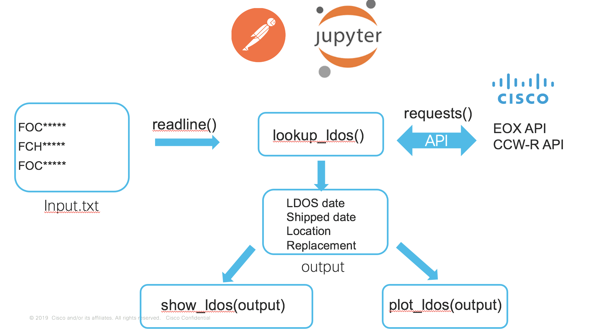

# Getting-LDOS-Info
Python code to automate getting LDOS info from a list of serial numbers
You will need to have API credentials to the Cisco EOX and CCW-R APIs. You will need to create a cred_api python library file to stoer the client id and key.

